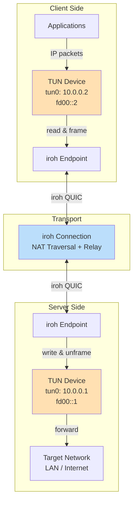
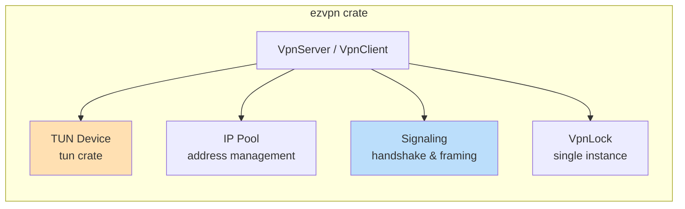
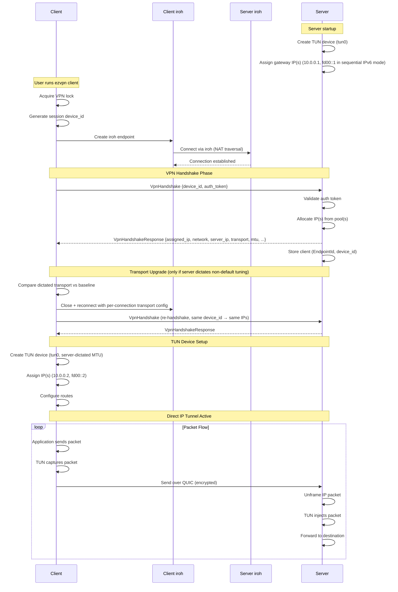
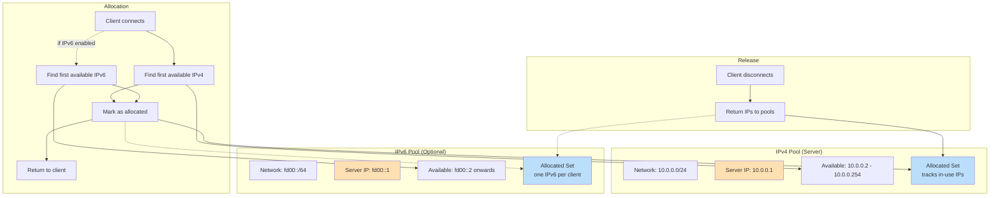
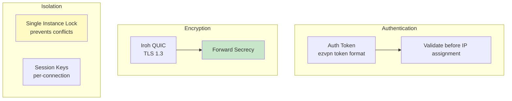
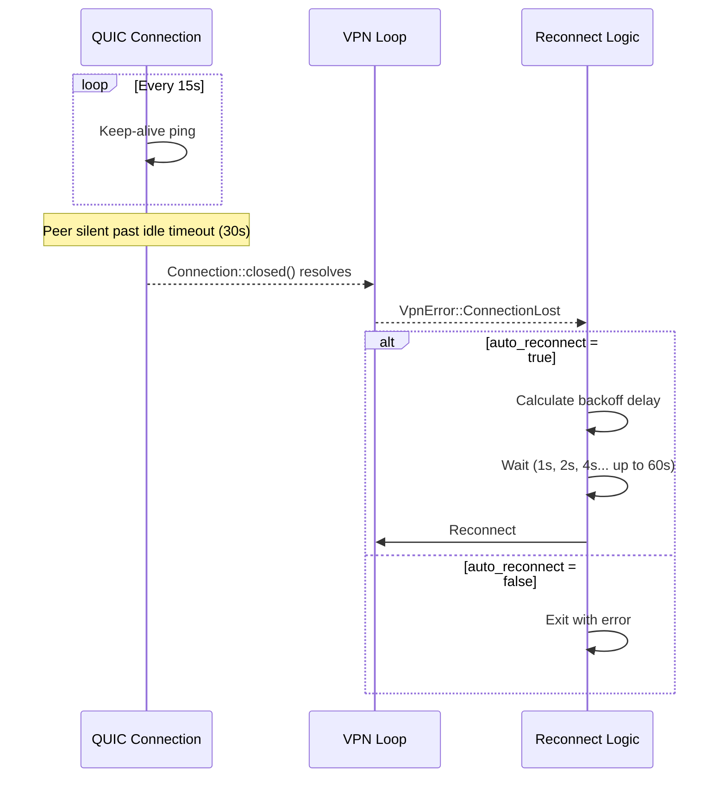

# ezvpn Architecture

`ezvpn` provides full-network tunneling using direct IP-over-QUIC. It creates a TUN device and routes IP traffic directly through encrypted iroh QUIC connections, eliminating double-encryption overhead while preserving TLS 1.3 security.

## VPN Mode

> **Note:** VPN mode requires root/admin privileges. On Windows, you also need `wintun.dll` from https://www.wintun.net/ (official WireGuard project) — download the zip, extract, and copy `wintun/bin/amd64/wintun.dll` to the same directory as the executable (or any directory in the system PATH).

### Architecture Overview



**IPv6 Dual-Stack Support:**

VPN mode supports optional IPv6 alongside IPv4. When `network6` is configured on the server, clients receive both an IPv4 address and an IPv6 address. This enables:
- Native IPv6 connectivity through the VPN tunnel
- Dual-stack applications (IPv4 and IPv6 simultaneously)
- IPv4-only operation when `network6` is not configured

IPv4 is optional: the server can run IPv6-only with `network6` and no `network`.

**Note:** VPN mode is not intended for stable client-to-client communications. Client IPs are dynamically assigned and may change between sessions.

### Key Components



### Connection Flow



**`VpnHandshakeResponse` Fields:**

The response includes different address fields depending on the server's address configuration:

| Mode | Fields in Response |
|------|-------------------|
| IPv4-only | `assigned_ip`, `network`, `server_ip` |
| IPv6-only | `assigned_ip6`, `network6`, `server_ip6` |
| Dual-stack | All six fields when both pools allocate: `assigned_ip`, `network`, `server_ip`, `assigned_ip6`, `network6`, `server_ip6` |

When `network6` is configured on the server, clients normally receive IPv6 addresses alongside IPv4 (dual-stack) or IPv6-only if `network` is omitted. In dual-stack mode, if one address pool is exhausted, the server can still accept the client with the other address family.

Every accepted response additionally carries the server-dictated settings (see "Server-Dictated Configuration" below): `transport` (`WireTransport`: congestion controller and concrete receive/send windows) and `mtu`.

### Server-Dictated Configuration

The server is the single source of truth for QUIC transport tuning (`[iroh.transport]`: congestion controller, receive/send windows) and the VPN `mtu`. Clients do not configure these; the server sends the fully resolved values in the handshake response and the client applies them:

- **MTU**: the server clamps its shared TUN MTU to `min(config.mtu, 1400)` (`DATAGRAM_SAFE_MTU`) and clamps each client's advertised `mtu` again to that connection's `max_datagram_size - DATAGRAM_FRAMING_OVERHEAD`. `QUIC_INITIAL_MTU` is 1452 (the IPv6-safe maximum for a standard 1500-byte Ethernet path), giving a handshake-time `max_datagram_size` of about 1416 and a datagram-safe inner MTU of about 1400. This assumes a >=1500-MTU path (LAN / most broadband). The client creates its TUN device after the handshake using the already-clamped `mtu`, and that TUN MTU cannot follow later QUIC path-MTU discovery because the TUN device MTU is fixed for the connection's life. On a constrained or tunnel-in-tunnel path, QUIC black-hole detection lowers the live path MTU but the TUN MTU stays high, so full-size packets may be dropped (`SendDatagramError::TooLarge`); the workaround is to lower the server `mtu` config so the advertised value starts small enough for that path. Keep the effective MTU >= 1280 for IPv6.
- **Transport tuning**: the congestion controller (and send window) cannot be changed on a live QUIC connection, so the client always connects with the default baseline (cubic, 8 MB windows). If the dictated `transport` differs from that baseline, the client closes the connection and reconnects once with a per-connection transport config (`Endpoint::connect_with_opts`), then re-handshakes. The same `device_id` is reused, so the server's idempotent IP allocation returns the same addresses. When the server runs default tuning, no extra reconnect occurs.

The shared builder (`build_quic_transport_config` in `src/transport/mod.rs`) is used for both endpoint creation and the per-connection upgrade, so both paths apply identical keep-alive, idle-timeout, congestion-controller and window settings. The wire values are resolved via `TransportTuning::effective_windows()` on the server, guaranteeing they match what the server's own endpoint uses.

### Direct IP over QUIC Integration

The VPN mode sends raw IP packets directly over iroh's unreliable QUIC datagrams (TLS 1.3). The reliable handshake runs once on a QUIC bi-stream; all IP traffic then rides datagrams, which avoids the head-of-line blocking of a reliable stream (a lost packet does not stall later ones — the inner transport retransmits as it would over plain UDP). This removes the double encryption overhead of running WireGuard inside QUIC.

**Key Design Decisions:**
- **Framing**: each datagram carries one message — `[type][offload_len][offload?][ip_packet]` — with no length prefix (the datagram boundary is the length). IP packets may be tagged with segmentation-offload metadata (see "Segmentation Offload" below). Datagrams are capped at the connection's `max_datagram_size`, so GSO super-frames are segmented to that cap on send.
- **Security**: Relies on iroh/QUIC's built-in encryption (TLS 1.3).
- **Efficiency**: Zero-copy forwarding where possible between TUN and QUIC buffers; TCP segments travel as coalesced super-packets when offload is available on either side.
- **Identification**: Clients identify via a random `u64` `device_id` generated at startup, allowing multiple sessions per iroh endpoint.
- **Reconnects**: The server automatically manages session limits and cleanup, allowing seamless reconnects from the same device ID.

**Device ID Generation:**

The `device_id` is generated at startup with `rand::rng().random::<u64>()`. It is a random session identifier, not an authentication secret; security relies on the ALPN knock token, the server's iroh endpoint identity, and the configured auth token.

**Security Considerations:**

The `device_id` is used **purely for session tracking** within an already-authenticated iroh connection—it is NOT used for access control. Security relies on:
1. the required ALPN token being embedded in the negotiated ALPN value
2. iroh's cryptographic server `EndpointId` authentication and QUIC/TLS encryption
3. Auth token validation

Clients are keyed by `(EndpointId, device_id)`, so an attacker cannot hijack a session by guessing a `device_id` without also possessing the victim's iroh private key and valid shared credentials.

**Collision Handling:**

The 64-bit ID space provides a ~2^32 birthday bound for collisions, which is sufficient for session tracking across reasonable client counts (thousands of concurrent sessions). Unpredictability is not a security requirement since `device_id` only differentiates sessions from the same authenticated endpoint. Random generation avoids predictable collision patterns and makes accidental collisions unlikely in practice.

### Segmentation Offload (GSO/GRO)

Per-packet cost dominates tunnel throughput: every ~MTU-sized TCP segment otherwise pays its own framing, channel send and QUIC write. `ezvpn` moves whole TCP "super-packets" (up to 64 KB) through the tunnel whenever possible and segments them as late as possible — ideally in the receiving kernel.

**Offload metadata:** IP frames may carry a 10-byte `virtio_net_hdr` (the Linux TUN `IFF_VNET_HDR` format, parsed/serialized in `src/tunnel/offload.rs`) describing TCP GSO state: segment size (MSS), header length and partial-checksum position. The v2 IP frame embeds it via the `offload_len` byte.

**Capability negotiation:**
- The client always advertises GSO support in its `VpnHandshake` (it can software-segment anything it receives).
- The server reports its TUN offload capability as `server_gso_enabled` in the handshake response, and sets `connection_gso_active = server TUN offload enabled && client advertised GSO` per client.

**Data paths** (each side picks per packet, based on what its local TUN supports):

| Path | Local TUN has offload | Behavior |
|------|----------------------|----------|
| Egress, kernel GRO | yes (Linux) | Kernel hands coalesced super-frames + `virtio_net_hdr` to the TUN reader; forwarded with metadata when the peer accepts GSO, otherwise software-segmented (`materialize_offload_into`) before framing |
| Egress, software GRO | no (macOS/Windows, or Linux without vnet headers) | `TcpGroTable` (in `offload.rs`) coalesces consecutive in-order same-flow TCP segments into a super-frame with a synthetic `virtio_net_hdr`, then flushes when the TUN read side drains |
| Ingress, kernel TSO | yes (Linux) | Offload-tagged frames are written to the TUN with their metadata; the kernel segments and completes checksums |
| Ingress, software segmentation | no | `materialize_offload_into` splits the super-frame into plain per-MSS packets with recomputed checksums before the TUN write |

**Software GRO details** (`TcpGroTable`, mirrors wireguard-go's `tun/tcp_offload_linux.go` semantics):
- Coalesces only clean in-order TCP: same flow key, contiguous sequence numbers, uniform MSS, byte-identical headers (TCP timestamps may advance; the latest is carried). SYN/RST/URG/CWR, pure ACKs, fragments and non-TCP packets pass through immediately — flushing any pending same-flow group first so in-flow ordering is preserved.
- FIN/PSH are only valid on a group's final segment and finalize it.
- Bounded: ≤16 in-flight flows, ≤64 segments and ≤65535 bytes per group.
- The coalesced TCP checksum field holds the folded (not complemented) pseudo-header sum per the Linux `CHECKSUM_PARTIAL` convention, so the receiving kernel/NIC completes it per segment under TSO.
- On the server's TUN→client direction, GRO state is additionally keyed per destination client and evicted when the client disconnects.

The outbound loops drain packets already queued on the TUN and flush pending software-GRO groups as soon as the read side drains; on a GSO-capable Linux TUN the software-GRO path is bypassed entirely (the kernel already coalesces).

### Throughput Design

- **Dedicated writer tasks**: the server runs a per-client writer task that owns a `Connection` clone and sends datagrams; the client sends datagrams inline from the TUN reader (a datagram send takes `&Connection`, so no writer task is needed). The TUN writer is also a dedicated task fed over an mpsc channel (no per-packet mutex).
- **Batched receives**: the TUN writer and per-client writer drain up to `WRITE_BATCH_SIZE` (256) items per `recv_many` to amortize task wakeups; each datagram is then sent with one `send_datagram_wait`.
- **Framing arena**: datagrams are appended to a long-lived 64 KB `BytesMut` (`build_datagrams` / `encode_ip_datagram`) and split off as refcounted `Bytes` views, so the allocator is hit once per arena chunk instead of once per packet.
- **Zero-copy sends**: `Bytes` flow from framing through the channel to the QUIC write without copying.
- **macOS utun fast path**: Darwin TUN splitting duplicates the `utun` fd and drives it with `AsyncFd` directly. Reads fill the packet arena with the 4-byte address-family prefix still attached, then strip that prefix by slicing; writes use `writev([prefix, packet])` so the IP packet does not need to be copied into a temporary header-prepended buffer.

### IP Pool Management



When both `network` and `network6` are configured, each client normally receives both an IPv4 and IPv6 address. If one family is exhausted in dual-stack mode, the server can still allocate the other family; if all configured pools are exhausted, the connection is rejected. If `network` is omitted, the IPv4 pool is not created and the server runs IPv6-only. The default IPv6 strategy allocates sequential /128 client addresses with release/reuse behavior similar to IPv4; `ip6_strategy = "node-id"` instead derives stable client IPv6 addresses from client iroh node IDs, derives the server IPv6 address from the server `EndpointId`, and rejects duplicate derived addresses. With a /64, sequential IPv6 pool exhaustion is not a practical concern for normal deployments.

### Platform-Specific Details

| Platform | TUN Device | Route Configuration | Privileges |
|----------|------------|---------------------|------------|
| Linux | `/dev/net/tun` | `ip route add` | CAP_NET_ADMIN or root |
| macOS | `utunX` | `route add` | root |
| Windows | `wintun.dll` | `netsh interface route` (VPN routes); `NetTCPIP` PowerShell cmdlets `Find-NetRoute`/`New-NetRoute` (underlay bypass host routes) | Administrator |

### Security Model



#### ALPN and Protocol Versioning

There are two independent version numbers, checked at two different layers:

- **ALPN/token-format version** — the advertised ALPN is `ezvpn/4/<token>`, where `4` is the ALPN/token-format version and `<token>` is the pre-shared ALPN "knock" token. A peer whose ALPN does not match (wrong version segment or wrong token) is rejected during QUIC ALPN negotiation, before any application streams are opened.
- **Wire protocol version** — `VPN_PROTOCOL_VERSION` (currently `3`) is carried inside the application handshake and is independent of the ALPN version. A peer that negotiates a matching ALPN but sends a mismatched wire protocol version is rejected during the handshake exchange, not during QUIC negotiation.

### Client Isolation

Inter-client traffic is dropped unconditionally on the server, in userspace, with no config flag and no firewall / `ip_forward` dependency.

The primary reason it is mandatory: client IPs are dynamic and constantly change — dynamically assigning non-overlapping client IPs is a core feature of this VPN — so only the server's VPN IP is stable. Any allow/deny policy keyed on client IPs would be unmanageable, so the safe default is to forbid all client-to-client traffic outright.

In `handle_client_data` (`src/tunnel/server.rs`), after the anti-spoofing source check, the inbound packet's destination IP is looked up in `ip_to_endpoint` / `ip6_to_endpoint`. A hit means the destination is another VPN client (or self), so the packet is dropped (counted by `packets_inter_client_blocked`) instead of being written to the TUN for the kernel to forward back out. Only client-assigned IPs live in those maps, so the server/gateway VPN IP and all external/internet destinations are unaffected — the gateway is the only in-VPN peer a client can reach. The drop is on the inbound side, so client→client packets never reach the TUN and the TUN reader never sees them.

**Pinging your own assigned IP** behaves differently per platform, and this is
expected/accepted (not fixed):

- **Linux** answers a self-ping locally — assigning `10.x.y.z/24` to the TUN
  installs a `local`-table route so traffic to the host's own VPN address loops
  back in-kernel and never enters the tunnel. So it works.
- **macOS** makes the TUN a point-to-point `utun`
  (`inet <self> --> <gateway> netmask 0xffffff00`). A self-ping matches the
  on-link `/24` route and is sent out the tunnel to the server, where the client
  isolation check above drops it (the destination is a client-assigned IP — this
  client's own). So it does not work.

This is standard macOS VPN behavior, not something we do differently: `utun`
interfaces are inherently point-to-point, and every macOS VPN (WireGuard,
OpenVPN, etc.) sets the tunnel up this way. The self-ping difference is a
consequence of following that platform convention, so there is nothing on our
side to fix — and pinging your own VPN IP has no real use case anyway (under
normal routing that traffic goes to the server regardless). Adding a client-side
loopback route to mask it would be the non-standard move, so we don't.

### Auto-Reconnect and Connection Health

VPN mode includes automatic reconnection when the tunnel connection fails. This handles scenarios like server restarts or network partitions.

**Configuration:**
- `auto_reconnect = true` (default): Automatically reconnect on connection loss
- `auto_reconnect = false`: Exit on first disconnection
- `max_reconnect_attempts`: Limit total attempts (unlimited if not set)

**Health Monitoring:**

The data path is unreliable datagrams with no application-level heartbeat. Peer
liveness is detected entirely by QUIC:

- **QUIC keep-alive** (15s interval) keeps NAT mappings warm and exercises the path.
- **QUIC idle timeout** (30s) closes a connection whose peer has gone silent.
- The client awaits `Connection::closed()`; when it resolves (idle timeout, peer
  close, or path failure) the tunnel tears down and (if enabled) reconnects.
- TUN read/write errors and datagram read/send errors also end the tunnel.

These keep-alive / idle-timeout values live in `src/transport/mod.rs`
(`QUIC_KEEP_ALIVE_INTERVAL`, `QUIC_IDLE_TIMEOUT`).

**Datagram framing:**

Each datagram carries one message, prefixed with a 1-byte `DataMessageType`
(`src/tunnel/signaling.rs`). The datagram boundary is the message length, so
there is no length prefix:

```
  IP packet (type 0x00):
    [0x00] [1 byte: offload_len (0 or 10)]
           [offload_len bytes: virtio_net_hdr] [N bytes: raw IP packet]
```

GSO capability is negotiated in the reliable handshake (the client advertises
`gso_enabled` in `VpnHandshake`), so there is no separate capabilities message.

**Implementation locations** (search by symbol name; line numbers may shift):
- Type enum: `DataMessageType` in `signaling.rs`
- Datagram framing: `encode_ip_datagram()` / `build_datagrams()` / `classify()` in `datagram.rs`; body parsing `parse_ip_packet_v2()` in `signaling.rs`
- Client send (outbound): TUN reader task in `client.rs` - frames via `build_datagrams()` and `Connection::send_datagram_wait()`
- Client receive (inbound): inbound task in `client.rs` - `Connection::read_datagram()` then `classify()`
- Client liveness: task awaiting `Connection::closed()` in `client.rs`
- Server send: TUN reader task in `server.rs` - frames via `build_datagrams()`, sent by the per-client writer task
- Server receive: `handle_client_data()` in `server.rs` - `Connection::read_datagram()` then `classify()`

**Compatibility note:** Peers must speak the same framing version; there is no backward compatibility at 0.0.x.

**Connection Check:**



**Reconnection Backoff:**
- Base delay: 1 second
- Exponential growth: 1s → 2s → 4s → 8s → 16s → 32s → 60s
- Maximum delay: 60 seconds
- Jitter: 0-500ms added to prevent thundering herd
- Counter reset: Resets to 0 after successful tunnel operation

### Client Network Consistency Check (Reconnect)

On reconnect the client compares the server's network params (`assigned_ip`, `network`, `gateway`, the IPv6 trio, and `mtu`) against the params established on the first successful handshake. A change to *just* the assigned client IP (`assigned_ip` / `assigned_ip6`) is not fatal: the client logs a warning, adopts the new IP as the baseline, and rebuilds the TUN device and routes for the new address (every `connect()` builds these fresh anyway). This is what a server restart that reassigns a different IP looks like. A change to any other field (`network`, `gateway`, the IPv6 trio, or `mtu`) is a fatal `VpnError::ServerConfigChanged` that quits the program instead of reconfiguring into inconsistent routing / TUN state. The stable per-process `device_id` (generated once in `VpnClient::new`) means the server normally re-assigns the same IP, so reassignment is the exception, not the norm. See `check_params_against` / `NetworkParams::non_ip_fields_eq` in `src/tunnel/client.rs`.

---
